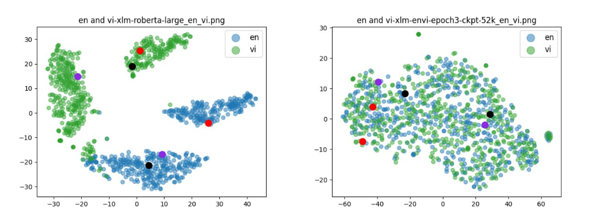

# mSimCSE
Maps cross-lingual sentences into a shared embedding space using English contrastive learning only.

## Requirement
First, install PyTorch by following the instructions from the official website. To faithfully reproduce our results, please use the correct 1.10.1 version corresponding to your platforms/CUDA versions. For example, if you use Linux and CUDA11 (how to check CUDA version), install PyTorch by the following command,

`pip install torch==1.10.1+cu111 torchvision==0.11.2+cu111 torchaudio==0.10.1 -f https://download.pytorch.org/whl/cu111/torch_stable.html`

If you instead use **CUDA** <11 or **CPU**, install PyTorch by the following command,

`pip install torch==1.10.1`

Then run the following script to install the remaining dependencies,

`pip install -r requirements.txt`

## Training
### Data
Update soon . . .
### Training scripts
We provide example training scripts for both supervised VSimCSE. In run_sup_example.sh we give a multiple-GPU example for the supervised version. Both scripts call train.py for training. We explain the arguments in following:

- `--train_file`: Training file path. We support "txt" files (one line for one sentence) and "csv" files (2-column: pair data with no hard negative; 3-column: pair data with one corresponding hard negative instance). You can use our provided Wikipedia or NLI data, or you can use your own data with the same format.
- `--model_name_or_path`: Pre-trained checkpoints to start with. For now we support BERT-based models (bert-base-uncased, bert-large-uncased, etc.) and RoBERTa-based models (RoBERTa-base, RoBERTa-large, etc.).
- `--temp`: Temperature for the contrastive loss.
- `--pooler`: Pooling method. Now we support.
    - `cls` (default): Use the representation of [CLS] token. A linear+activation layer is applied after the representation (it's in the standard BERT implementation). If you use supervised SimCSE, you should use this option.
    - `cls_before_pooler`: Use the representation of [CLS] token without the extra linear+activation. If you use unsupervised VSimCSE (doesn't support), you should take this option
    - `avg`: Average embeddings of the last layer. If you use checkpoints of SBERT/SRoBERTa (paper), you should use this option.
    - `avg_top2`: Average embeddings of the last two layers
    - `avg_first_last`: Average embeddings of the first and last layers. If you use vanilla BERT or RoBERTa, this works the best.
- `--mlp_only_train`: We have found that for unsupervised SimCSE, it works better to train the model with MLP layer but test the model without it. You should use this argument when training unsupervised SimCSE models.
- `--hard_negative_weight`: If using hard negatives (i.e., there are 3 columns in the training file), this is the logarithm of the weight. For example, if the weight is 1, then this argument should be set as 0 (default value).

All the other arguments are standard Huggingface's transformers training arguments. Some of the often-used arguments are: `--output_dir, --learning_rate, --per_device_train_batch_size.`

## Evaluate plot images
```sh
bash scripts/analysis_embds.sh
```
In left,the sentence embeddings from different languages areclearly separated into two clusters. In right, after training, the embedding space becomes indistin-guishable for different languages, and the parallel sentences are aligned to each other.


 
## License
Copyright &copy; 2023 [Pythera AI](https://github.com/pytheralab). All rights reserved.